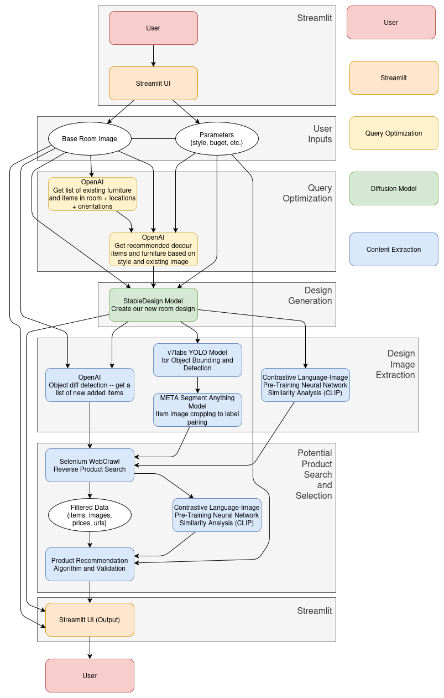

# ReModel

This was a project we designed for the Georgia Tech Hacklytics 2025 Hackathon.

[Link to our DevPost](https://devpost.com/software/baguettes?ref_content=my-projects-tab&ref_feature=my_projects).



## Models

### Current

Our current stack includes the following models:

| Model                                | Origin        | Link                                                                                                | Purpose and Details |
| :----------------------------------- | :------------ | :-------------------------------------------------------------------------------------------------- | :------------------ |
| GPT-4o                               | OpenAI        | [OpenAI](https://openai.com/index/hello-gpt-4o/)                                                    |                     |
| GPT-4o mini                          | OpenAI        | [OpenAI](https://openai.com/index/gpt-4o-mini-advancing-cost-efficient-intelligence/)               |                     |
| StableDesign                         |               |                                                                                                     |                     |
| StableDiffusion                      |               |                                                                                                     |                     |
| YOLO 8m                              | Ultralytics   | [GitHub](https://github.com/ultralytics/ultralytics) & [Docs](https://docs.ultralytics.com/)        |                     |
| Segment Anything Model (SAM) `VIT-H` | Meta Research | [GitHub](https://github.com/facebookresearch/segment-anything?tab=readme-ov-file#model-checkpoints) |                     |
|                                      |               |                                                                                                     |                     |

### Past and Planned

During previous stages of our development and/or in the intended designs we had but weren't able to implement yet, we include the following models in addition to the current:

| Model                                                           | Origin         | Link                                                                                                                                                                                 | Purpose and Details |
| :-------------------------------------------------------------- | :------------- | :----------------------------------------------------------------------------------------------------------------------------------------------------------------------------------- | :------------------ |
| Contrastive Language-Image Pre-Training (CLIP) Commit `dcba3cb` | OpenAI         | [GitHub](https://github.com/openai/CLIP)                                                                                                                                             |                     |
| OmniGen                                                         | VectorSpaceLab | [GitHub](https://github.com/VectorSpaceLab/OmniGen) & [Replicate](https://replicate.com/vectorspacelab/omnigen) & [Hugging Face](https://huggingface.co/Shitao/OmniGen-v1/tree/main) |                     |

## Running Locally

We recommend setting up a `conda` or ve`nv environment to run this.

### 1. Python Requirements

Within our pip requirements includes various packages for api calls and model downloads (such as for `openai`, `CLIP`, and `replicate`).

```bash
pip install -r requirements.txt
```

### 2. Selenium Setup

This is used for our content matching phase for product matching purposes.

**Download Page**: https://googlechromelabs.github.io/chrome-for-testing/#stable

### 3. Local Model Setup

Ultralytics's `You Only Look Once 8m` (`Yolo8m`) and Meta (Facebook) Research's `Segment Anything Model` (`SAM`) models are required for our content extraction phase. They're used for furniture and decor item identification within our generated design plans.

| Model Name | Direct Download Link                                                                                     | Docs and Details                                                                                                                 |
| :--------- | :------------------------------------------------------------------------------------------------------- | :------------------------------------------------------------------------------------------------------------------------------- |
| YOLO8m     | [Ultralytics Direct Download](https://github.com/ultralytics/assets/releases/download/v8.2.0/yolov8m.pt) | [Ultralytics YOLO8m Docs](https://docs.ultralytics.com/models/yolov8/#performance-metrics)                                       |
| VIT-H SAM  | [Meta's Direct Download](https://dl.fbaipublicfiles.com/segment_anything/sam_vit_h_4b8939.pth)           | [Facebook Research's Github SAM Docs](https://github.com/facebookresearch/segment-anything?tab=readme-ov-file#model-checkpoints) |

### 4. Running the Program

```bash
streamlit run app.py
```
